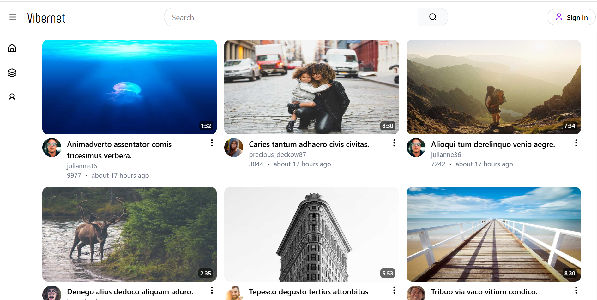

# Vibernet - A youtube clone 

A fully featured youtube clone that built from scratch using MERN stack.

[Frontend Code](https://github.com/PraveenDKatti/vibernet-frontend) | [backend code](https://github.com/PraveenDKatti/vibernet-backend) | [live demo](https://vibernet.vercel.app)

---
## Purpose
I built this project to understand frontend backend communication, handling of large media assets, cloud object storage, complex data queries in nosql database and api handling.

### Screenshot:


---

## Tech stack and Architecture 

* **State Management** Chose **zustand** for global state management to prevent prop drilling and makes code mdular.

* **Cloud Storage**
Integrated **DigitalOcean** for scalable cloud storage of media assets.

* **Backend Framework** utlized **Express** js for api handling and routing.

* **Authentication** implemented **JWT** auth for secure login and account session access.

### System Architecture
```text
### Architecture of Application:
[Client/Frontend]<-->[REST API's]<--->[Mongoose/Backend]
                            |
                    [digital ocean]
```

## Features:
* Secure Authentication Pipeline.
* Cloud based media uploads (How the file gets from the user to cloud).
* Relational state tracking (to track individual data arrays like watchhistory, watchlater etc.,).

## Local setup guide

### frontend:
    1. Open your terminal in the frontend directory.
    2. Run npm install to install required dependencies.
    3. Run npm run dev to spin up the local development server.

### backend:
    1. Open your terminal in the backend directory.
    2. Configure your environment variables (.env) for your JWT secret, Mongoose URI, and cloud storage keys.
    3. Run npm install to install backend dependencies.
    4. Run npm run dev to start the backend API.

## Future enhancement:
* Optimize the backend API reponses time and mitigate render free tier cold start.
* Responsive UI's across different devices like, mobile/Tab/Desktop.
